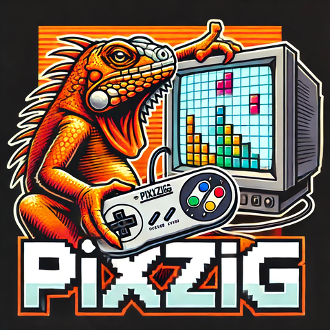

# Overview

Pixzig is a game engine intended for writing 2d games.  The goal is to make it simple and fun to make games that can run on native targets (Windows and Linux in particular) as well as in the browser via emscripten.  It's a hobby project, and not intended for broader use, but if you want to fork it or use it as inspiration, have fun! :smile:

