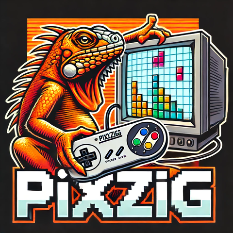

# :rocket: Getting Started



Pixzig is a 2D game engine written in Zig. It provides a fixed-timestep [game loop](sym:PixzigAppRunner), [Rendering](sym:Renderer) with OpenGL (sprites, shapes, text), ECS via flecs, [Lua scripting](sym:ScriptEngine), [audio](mod:audio), [keyboard/mouse/gamepad input](mod:input), and an [extensible action sequencer](sym:SequencePlayer).

!!! warning "AI Generated Docs"
    These initial docs were generated with AI and only some parts have been curated so far.  I'll remove this warning once I've reviewed and edited all of the docs to be correct.

## Adding Pixzig to Your Project

Declare pixzig as a dependency in your `build.zig.zon`:

```zig
.dependencies = .{
    .pixzig = .{
        .path = "../pixzig", // or a URL + hash for a fetched dep
    },
},
```

In your `build.zig`, pull in the engine module and library using `buildGame`:

```zig
// Create your game module here.
const exe_mod = b.createModule(.{ .root_source_file = b.path("src/main.zig"), ... });

const pixzig = b.dependency("pixzig", .{ .target = target, .optimize = optimize });

// Build the game (works for desktop and web via emscripten)
const exe = pixzig.buildGame(b, target, optimize,
    pixzig,
    pixzig.module("pixzig"),
    "my_game",
    exe_mod,
    // There are resources you want to include in your game.
    &.{ "my_atlas.json", "my_atlas.png" },
);
```

## Minimal Example

The smallest working pixzig program creates an `AppRunner`, initialises an app struct, and hands control to the engine:

```zig
const std   = @import("std");
const pixzig = @import("pixzig");
const glfw  = pixzig.glfw;

// You need to export these symbols publicly for the panix handler and logging
// to work properly on both desktop as well as emscripten builds.
pub const panic      = pixzig.system.panic;
pub const std_options = pixzig.system.std_options;

// This defines your app using your app structure and the engine build options
// This then defines `AppRunner.Engine` for convenience.
const AppRunner = pixzig.PixzigAppRunner(App, .{});

pub const App = struct {
    pub fn init(_: std.mem.Allocator, _: *AppRunner.Engine) !*App {
        // one-time setup here
        return &App{};
    }

    pub fn deinit(_: *App) void {}

    pub fn update(_: *App, eng: *AppRunner.Engine, _: f64) bool {
        if (eng.keyboard.pressed(.escape)) return false;
        return true;
    }

    pub fn render(_: *App, eng: *AppRunner.Engine) void {
        eng.renderer.clear(0.1, 0.1, 0.2, 1);
    }
};

pub fn main() !void {
    // We use the C allocator since that is what works on Emscripten builds.
    const alloc     = std.heap.c_allocator;
    const appRunner = try AppRunner.init("My Game", alloc, .{});
    const app       = try App.init(alloc, appRunner.engine);
    glfw.swapInterval(1);

    // This calls your `App`'s `update` 120 times a second
    // and `render` as much as possible.
    appRunner.run(app);
}
```
