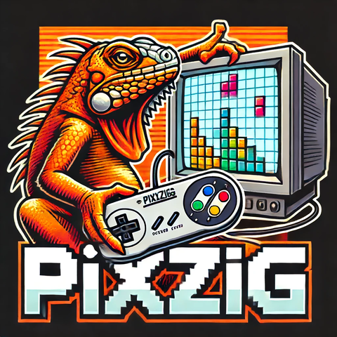

# Getting Started



Pixzig is a Zig 2D game engine with a fixed-timestep [game loop](sym:PixzigAppRunner), OpenGL [rendering](sym:Renderer), flecs ECS, [Lua scripting](sym:ScriptEngine), [audio](mod:audio), [input](mod:input), and [sequences](sym:SequencePlayer).

## Adding Pixzig to Your Project

Declare pixzig as a dependency in your `build.zig.zon`:

```zig
.dependencies = .{
    .pixzig = .{
        .path = "../pixzig", // or a URL + hash for a fetched dep
    },
},
```

In your `build.zig`, import `buildGame` and a manifest constructor from pixzig's build module and call `buildGame` with a `ManifestHandle` as the final argument:

```zig
const buildGame = @import("pixzig").buildGame;
const manifestFromDef = @import("pixzig").manifestFromDef;

pub fn build(b: *std.Build) void {
    const target = b.standardTargetOptions(.{});
    const optimize = b.standardOptimizeOption(.{});

    const pixzig_dep = b.dependency("pixzig", .{ .target = target, .build_examples = false });

    const exe_mod = b.createModule(.{
        .root_source_file = b.path("src/main.zig"),
        .target = target,
        .optimize = optimize,
    });

    // No assets yet; pass an empty manifest. See the Asset Manifest doc to
    // add textures, atlases, fonts, and other assets.
    const manifest = manifestFromDef(b, .{});

    const game = buildGame(b, target, optimize,
        pixzig_dep,
        pixzig_dep.module("pixzig"),
        "my_game",
        exe_mod,
        manifest,
    );

    b.default_step.dependOn(&game.step);
}
```

`manifestFromDef` defines assets inline; use `manifestFromFile(b, "assets/manifest.json")` instead if the manifest lives as a separate JSON file. See [Asset Manifest](assets.html) for the full manifest format and runtime loading options.

## A Minimal Example

This application opens a window and exits when Escape is pressed:

```zig
const std = @import("std");
const pixzig = @import("pixzig");
const glfw = pixzig.glfw;

pub const panic = pixzig.system.panic;
pub const std_options = pixzig.system.std_options;

const AppRunner = pixzig.PixzigAppRunner(App, .{});

pub const App = struct {
    alloc: std.mem.Allocator,

    pub fn init(alloc: std.mem.Allocator, _: *AppRunner.Engine) !*App {
        const app = try alloc.create(App);
        app.* = .{ .alloc = alloc };
        return app;
    }

    pub fn deinit(self: *App) void {
        self.alloc.destroy(self);
    }

    pub fn update(_: *App, eng: *AppRunner.Engine, _: f64) bool {
        if (eng.inputs.keyboard.pressed(.escape)) return false;
        return true;
    }

    pub fn render(_: *App, eng: *AppRunner.Engine) void {
        eng.renderer.clear(0.1, 0.1, 0.2, 1);
    }
};

pub fn main() !void {
    const alloc = std.heap.c_allocator;
    const appRunner = try AppRunner.init("My Game", alloc, .{});
    const app = try App.init(alloc, appRunner.engine);
    glfw.swapInterval(1);

    appRunner.run(app);
}
```
