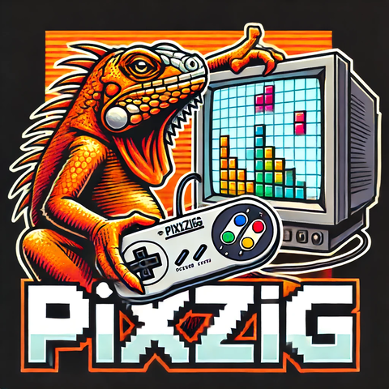

# Getting Started



Pixzig is a Zig 2D game engine with a fixed-timestep [game loop](sym:AppRunner), OpenGL [rendering](sym:Renderer), flecs ECS, [Lua scripting](sym:ScriptEngine), [audio](mod:audio), [input](mod:input), and [sequences](sym:SequencePlayer).

## Starting From the Template

The quickest start is to generate a project from pixzig's `template/` directory. From a pixzig checkout:

```sh
zig build new -Dname=my_cool_game -Ddest=../my_cool_game
cd ../my_cool_game
zig build my_cool_game   # builds and runs it
```

`-Ddest` is relative to the pixzig checkout (or absolute) and defaults to `../<name>`. The name must be a valid Zig identifier. The new project gets its own `build.zig.zon` fingerprint and a relative `.path` dependency on the checkout you ran it from; switch that to a URL + hash when you want a fetched dependency. It won't overwrite an existing directory.

The rest of this page explains what the template sets up.

## Adding Pixzig to Your Project

Declare pixzig as a dependency in your `build.zig.zon`:

```zig
.dependencies = .{
    .pixzig = .{
        .path = "../pixzig", // or a URL + hash for a fetched dep
    },
},
```

In your `build.zig`, import `buildGame` and a manifest constructor from pixzig's build module and call `buildGame` with a `ManifestHandle` as the final argument:

```zig
const buildGame = @import("pixzig").buildGame;
const manifestFromDef = @import("pixzig").manifestFromDef;

pub fn build(b: *std.Build) void {
    const target = b.standardTargetOptions(.{});
    const optimize = b.standardOptimizeOption(.{});

    const pixzig_dep = b.dependency("pixzig", .{ .target = target, .build_examples = false });

    // No assets yet; pass an empty manifest. See the Asset Manifest doc to
    // add textures, atlases, fonts, and other assets.
    const manifest = manifestFromDef(b, .{});

    _ = buildGame(b, .{
        .target = target,
        .optimize = optimize,
        .engine_dep = pixzig_dep,
        .name = "my_game",
        .root_source_file = b.path("src/main.zig"),
        .manifest = manifest,
    });
}
```

`buildGame` installs the executable to `zig-out/bin/my_game/` as part of `zig build`, and adds a `zig build my_game` step that runs it. The game doesn't need to depend on pixzig's install step, and doesn't need `use_llvm`. Set `game.use_llvm = true` on the returned compile step only if you want LLVM's fuller debug info for a debugger.

If the game needs its own imports, build the module yourself and pass it as `.root_module` instead of `.root_source_file`:

```zig
const exe_mod = b.createModule(.{
    .root_source_file = b.path("src/main.zig"),
    .target = target,
    .optimize = optimize,
});
exe_mod.addImport("zargunaught", zargs.module("zargunaught"));
// ... then `.root_module = exe_mod` in buildGame's options.
```

`BuildGameOptions` also takes these optional fields:

- `default_font` -- the font embedded in the executable as the renderer's default. It is pixzig's bundled Karla-Regular (`.karla`) unless you pass `.{ .path = b.path("assets/MyFont.ttf") }` to embed your own font instead, or `.none` to embed no font. Every game in one `build.zig` shares the engine module, so they must all use the same `default_font`.
- `package` -- copy assets next to the executable. When null, the `-Dpackage` build option decides. It is declared once, so a game and its editor can both leave this null.
- `install` -- defaults to `true`: install the executable to `zig-out/bin/<name>/` on `zig build`. Native only.
- `wrap_root` -- defaults to `true`. `buildGame` generates a tiny executable root module that installs pixzig's panic and log handlers, then calls your module's `main`. Set `.wrap_root = false` if your own root module deliberately provides `panic`, `std_options`, or other root-only declarations.

`manifestFromDef` defines assets inline; use `manifestFromFile(b, "assets/manifest.json")` instead if the manifest lives as a separate JSON file. See [Asset Manifest](assets.html) for the full manifest format and runtime loading options.

Because `wrap_root` is on by default, game source files do not need to define
`pub const panic = pixzig.internal.system.panic` or
`pub const std_options = pixzig.internal.system.std_options`. The generated root wrapper
handles that for native and Emscripten builds, while your module stays focused
on its `main`, app type, and game code. The wrapper supports either
`pub fn main() !void` or `pub fn main(init: std.process.Init) !void`.
When adding game-specific imports or options, add them to the module you pass as
`.root_module` (`exe_mod` above); with wrapping enabled, the returned compile
step's root module is the generated wrapper.

## A Minimal Example

This application opens a window and exits when Escape is pressed:

```zig
const std = @import("std");
const pixzig = @import("pixzig");

const AppRunner = pixzig.AppRunner(App, .{});

pub const App = struct {
    alloc: std.mem.Allocator,

    pub fn init(alloc: std.mem.Allocator, _: *AppRunner.Engine) !*App {
        const app = try alloc.create(App);
        app.* = .{ .alloc = alloc };
        return app;
    }

    pub fn deinit(self: *App) void {
        self.alloc.destroy(self);
    }

    pub fn update(_: *App, eng: *AppRunner.Engine, _: f64) bool {
        if (eng.inputs.keyboard.pressed(.escape)) return false;
        return true;
    }

    pub fn render(_: *App, eng: *AppRunner.Engine) void {
        eng.renderer.clear(26, 26, 51, 255);
    }
};

pub fn main(init: std.process.Init) !void {
    const appRunner = try AppRunner.init("My Game", init.gpa, .{});
    defer appRunner.deinit();

    const app = try App.init(init.gpa, appRunner.engine);
    defer app.deinit();

    appRunner.run(app);
}
```
